# 💼 Job Portal Application (React + Spring Boot)

A full-stack Job Portal web application built using **React (Frontend)**
and **Spring Boot (Backend)**.\
This platform allows users to browse jobs, post jobs, and manage
applications.

------------------------------------------------------------------------

## 🚀 Tech Stack

### 🔹 Frontend

-   React.js
-   Axios
-   Bootstrap / CSS

### 🔹 Backend

-   Spring Boot
-   Spring Data JPA
-   REST APIs
-   Maven

### 🔹 Database

-   MySQL / H2 (configurable in `application.properties`)

------------------------------------------------------------------------

## 📂 Project Structure

    job-portal-react-springboot/
    │
    ├── backend/               # Spring Boot Application
    ├── frontend/              # React Application
    └── project-screenshots/   # Application Screenshots

------------------------------------------------------------------------

## ⚙️ How To Run The Project

### 1️⃣ Run Backend (Spring Boot)

``` bash
cd backend
mvn clean install
mvn spring-boot:run
```

Backend runs on: http://localhost:8080

------------------------------------------------------------------------

### 2️⃣ Run Frontend (React)

``` bash
cd frontend
npm install
npm start
```

Frontend runs on: http://localhost:3000

------------------------------------------------------------------------

## 📸 Application Screenshots

Below are screenshots from the `project-screenshots` folder:

### 🔹 1.png

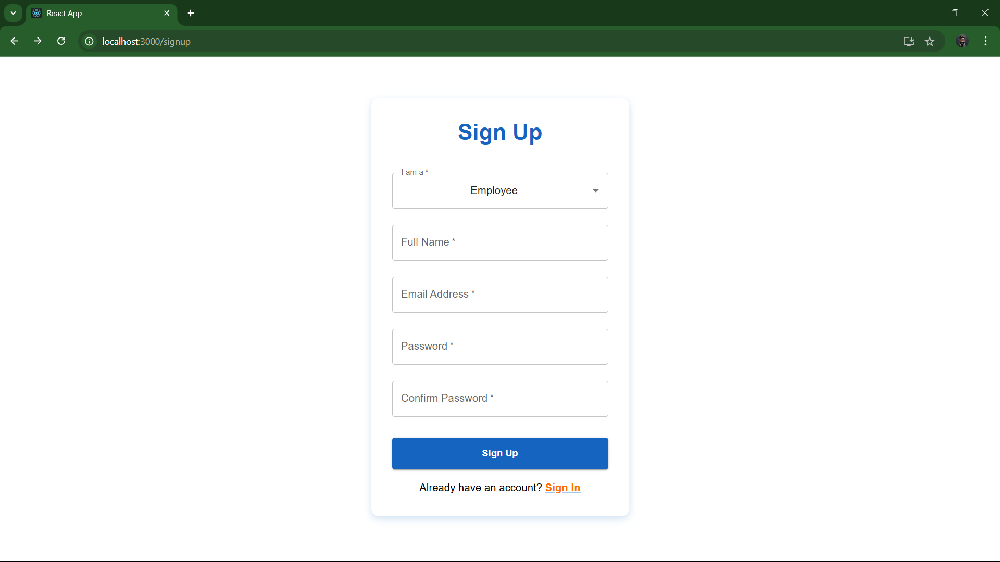

### 🔹 2.png

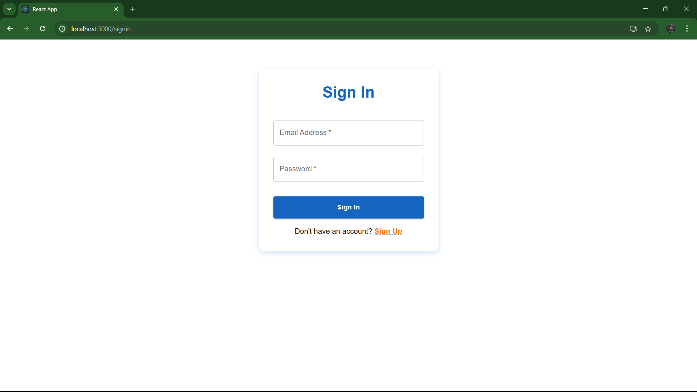

### 🔹 3.png

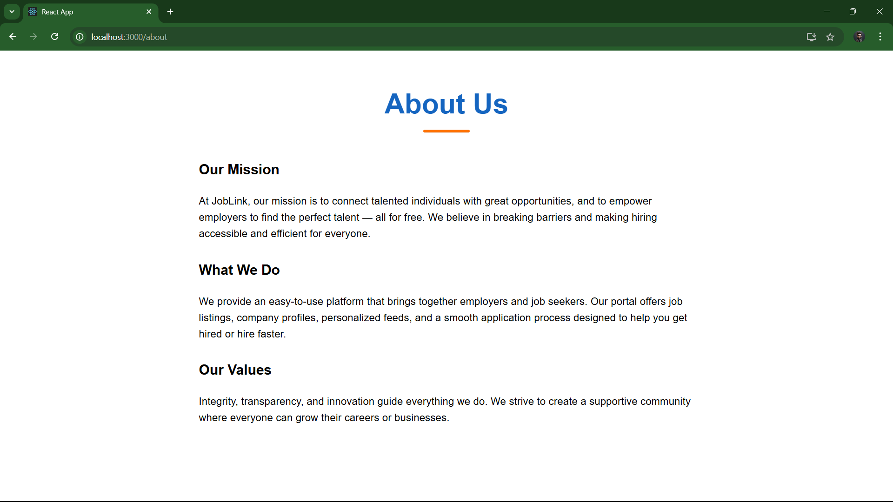

### 🔹 4.png

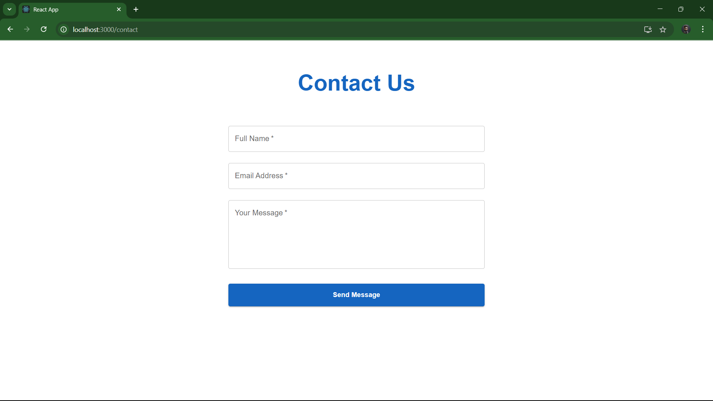

### 🔹 5.png

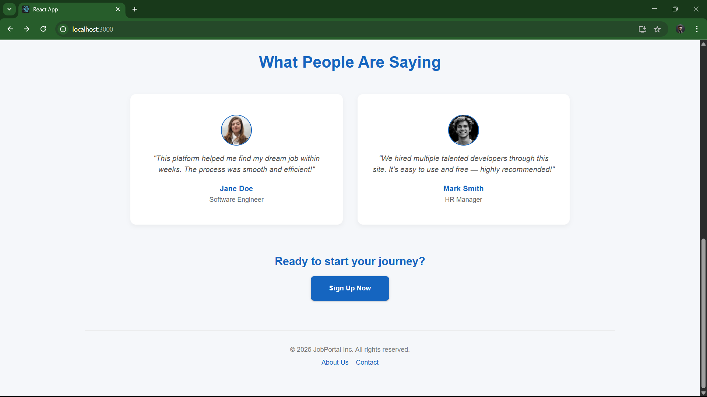

### 🔹 6.png

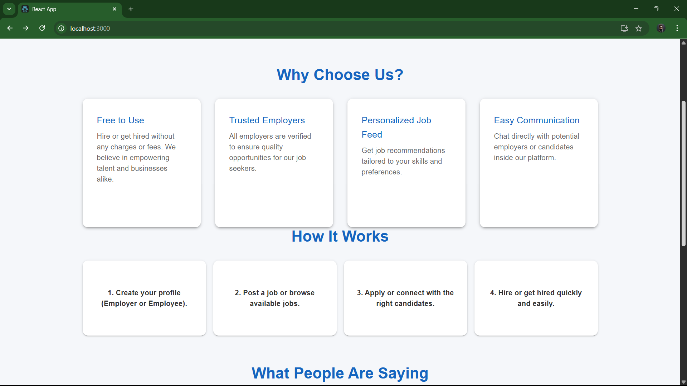

### 🔹 7.png

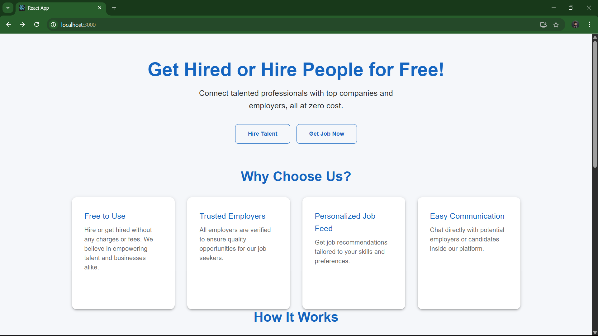

### 🔹 8.png

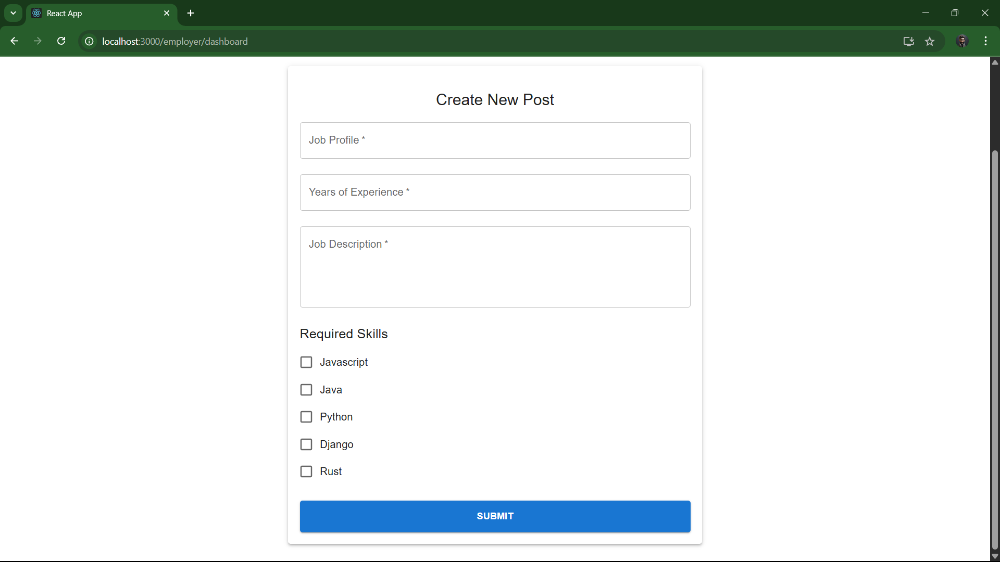

### 🔹 9.png

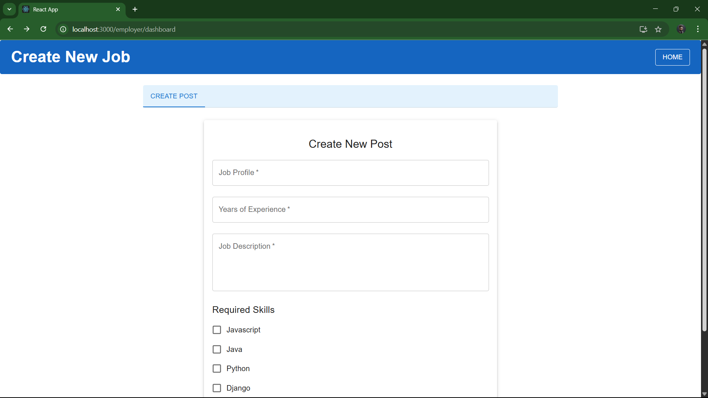

### 🔹 10.png

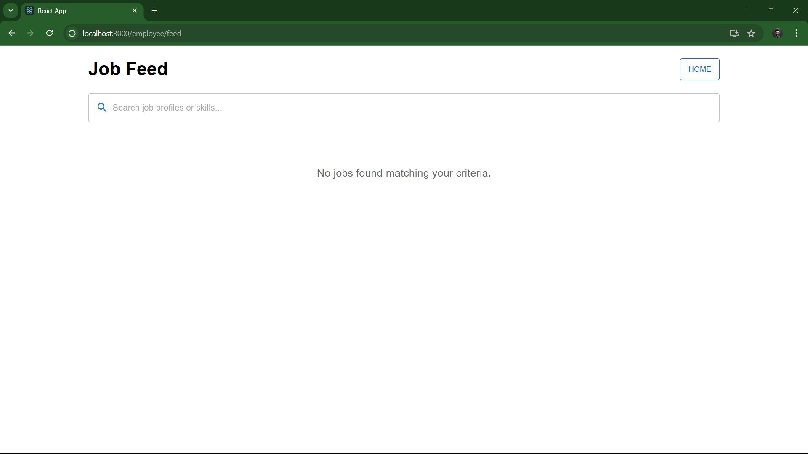

### 🔹 11.png

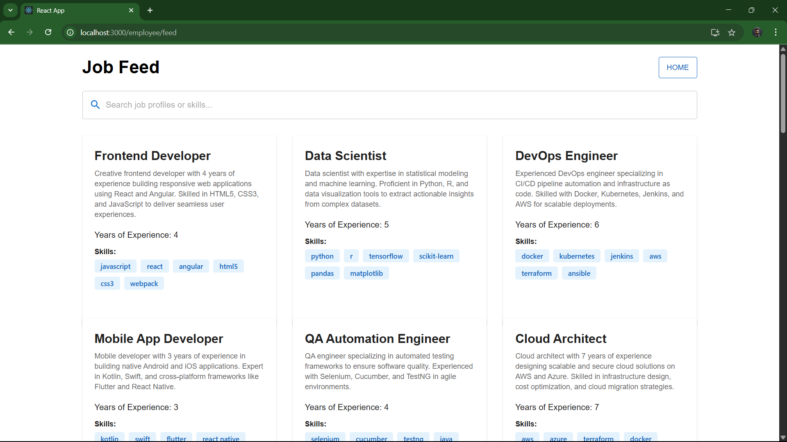

### 🔹 12.png

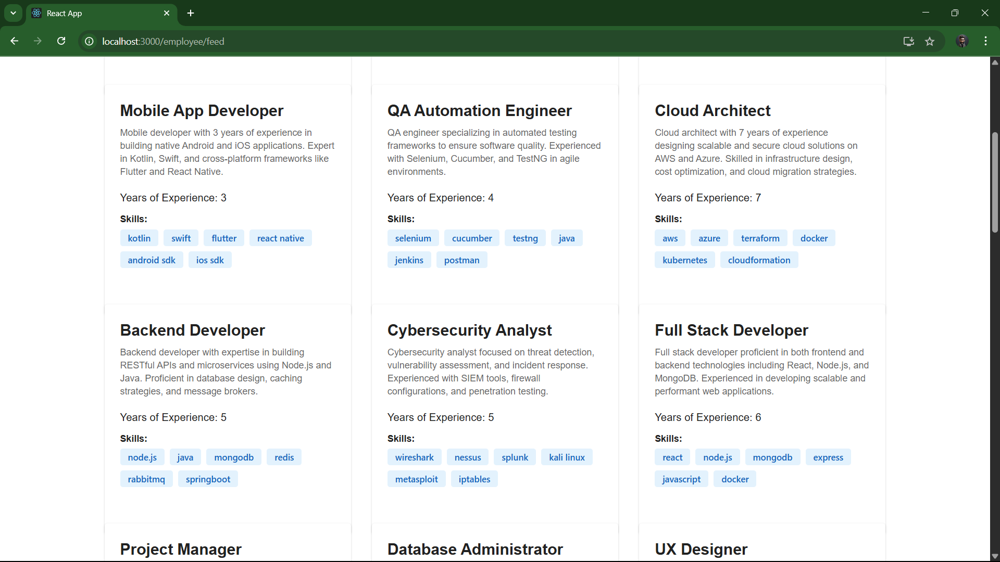

### 🔹 13.png

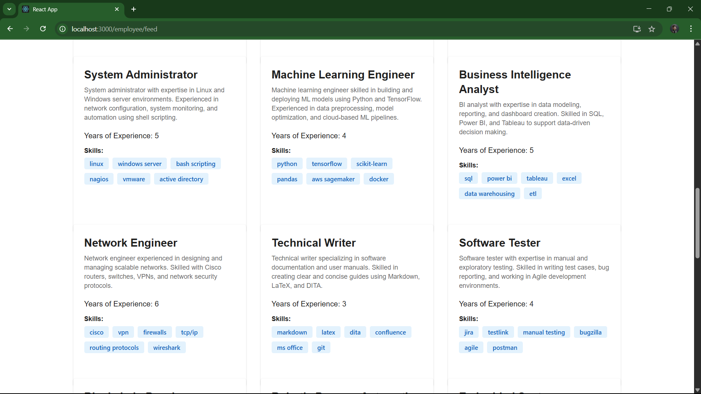

### 🔹 14.png

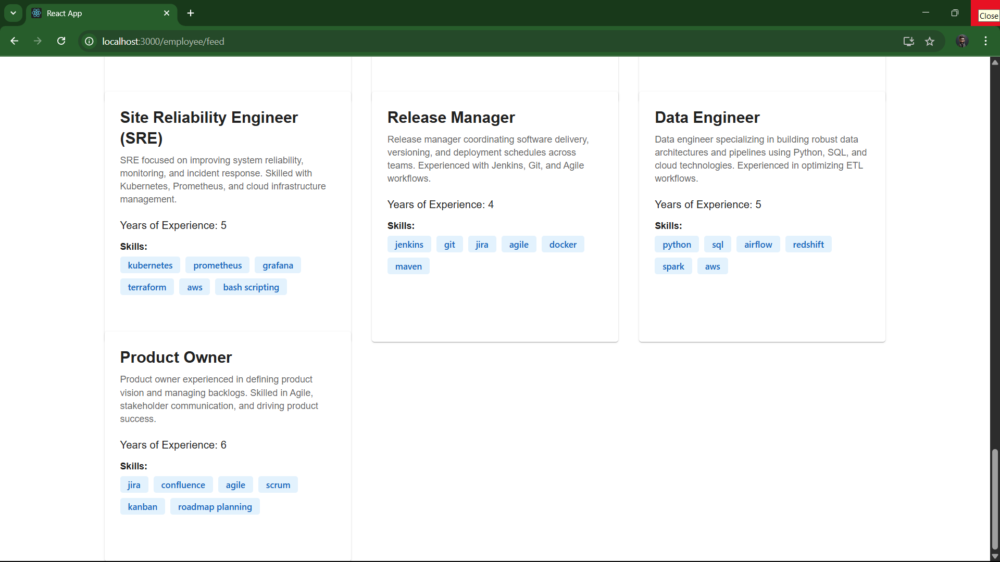

### 🔹 15.png

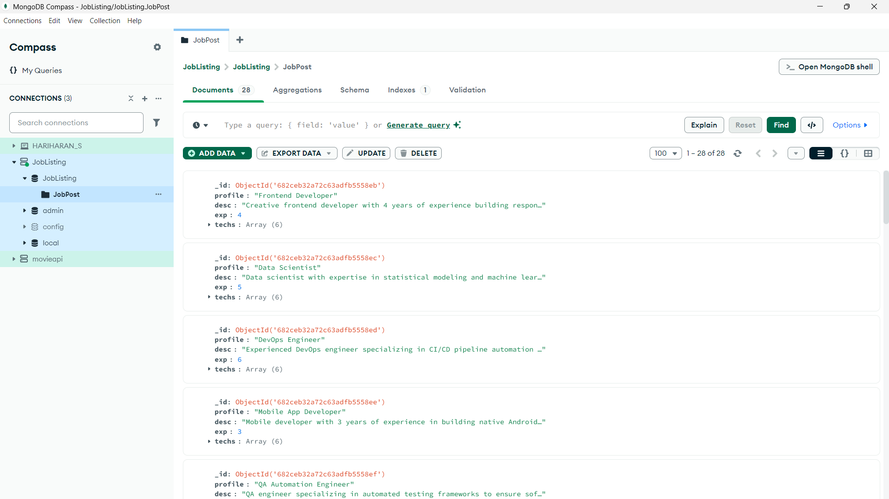

### 🔹 16.png

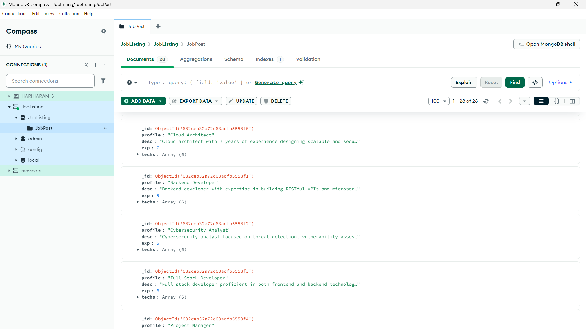

------------------------------------------------------------------------

## ✨ Features

-   User Registration & Login
-   Post New Jobs
-   View Available Jobs
-   Apply to Jobs
-   RESTful API Architecture
-   Clean UI with React

------------------------------------------------------------------------

## 📌 Future Improvements

-   JWT Authentication
-   Role-Based Access Control
-   Resume Upload Feature
-   Admin Dashboard
-   Deployment (AWS / Render / Railway)

------------------------------------------------------------------------

## 👩‍💻 Author

**Shruti**\
Backend Developer (Spring Boot)

------------------------------------------------------------------------

⭐ If you like this project, give it a star on GitHub!
 
 
 
  
 
  
   
  
   
 
